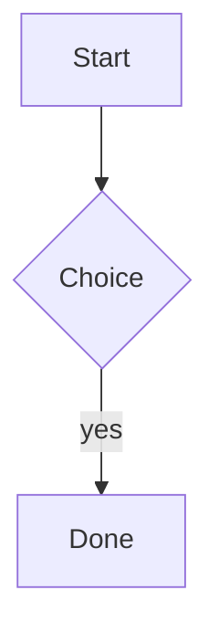

```js
const a = `tpl ${1}`;
```

~~~python title="demo.py"
def f():
    return "~~~ inside"
~~~


```mermaid
graph TD
  A[Start] --> B{Choice}
  B -->|yes| C[Done]
```

    indented code block

````md
```
nested fence
```
````
